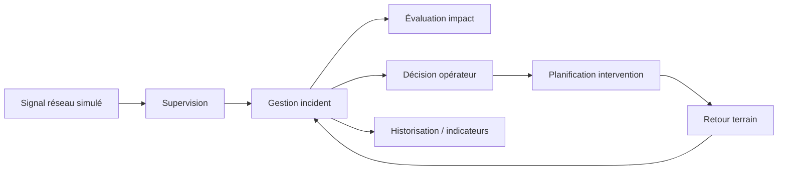

# E1 — Cartographie métier / fonctionnelle / DDD
Statut : DOCUMENTED_SYNTHETIC. Périmètre : **incident HTA/BT non critique simulé** ; aucune manœuvre réelle.

## Acteurs et capacités
| Acteur | Capacité métier | Service fonctionnel | Données |
|---|---|---|---|
| Agent de conduite habilité | Superviser / qualifier | Qualification d'alerte | signal, événement |
| Analyste réseau | Évaluer l'impact | Estimation d'impact | actifs, topologie versionnée |
| Responsable d'exploitation | Décider / autoriser | Décision humaine tracée | autorisation, justification |
| Gestionnaire interventions | Planifier | Ordre d'intervention | tâche, statut, affectation |
| Équipe terrain | Intervenir / confirmer | Compte rendu | observations, résultat |
| Superviseur qualité | Mesurer | Bilan incident | horodatage, délais, KPI |

## Chaîne d'architecture (vue logique illustratrice)

## Domaines fonctionnels / bounded contexts
1. **AssetTopology** : référentiel des actifs, version de graphe ; ne commande aucun équipement.
2. **NetworkObservation** : collecte événements, provenance, qualité et horodatage.
3. **IncidentManagement** : état canonique et corrélation de l'incident ; propriétaire de l'identifiant incident.
4. **ImpactAssessment** : calcule une estimation sur snapshot topologique ; n'est pas source de vérité d'un état réseau réel.
5. **OperationalDecision** : enregistre une décision humaine, autorisations et audit ; ne transporte aucune commande OT.
6. **FieldWork** : propriétaire du cycle de vie de l'ordre d'intervention.
7. **Reporting** : vues matérialisées, non maître des transactions.

## Cartographie SI de référence, sans attribution à Enedis
| Capacité | Application logique | API/événement | Source de vérité |
|---|---|---|---|
| Observer | observation-svc | ObservationReceived | journal observation |
| Qualifier | incident-svc | POST /incidents, IncidentQualified | incident-svc |
| Analyser | impact-svc | POST /assessments | impact-svc (évaluation) |
| Approuver | decision-svc | POST /decisions | journal de décision |
| Planifier | fieldwork-svc | POST /work-orders | fieldwork-svc |
| Visualiser | reporting-readmodel | vues lecture | dérivé seulement |

## Règles de frontière
- Anti-corruption layer entre systèmes industriels et SI métier, en lecture seule dans ce cas.
- Pas de propagation d'une télécommande vers OT depuis les microservices du scénario.
- Identifiants stables ; correlation-id / causation-id ; provenance et version des schémas ; données personnelles minimisées.
- Les rôles de validation opérationnelle sont des hypothèses et doivent être confrontés aux règles d'habilitation réelles avant toute mise en œuvre.

## Vue ArchiMate à réaliser/importer en outil
Business Actor → Business Process → Business Capability → Application Service → Application Component → Data Object. Il s'agit d'une **correspondance de concepts**, pas d'un fichier ArchiMate Exchange Format validé.
