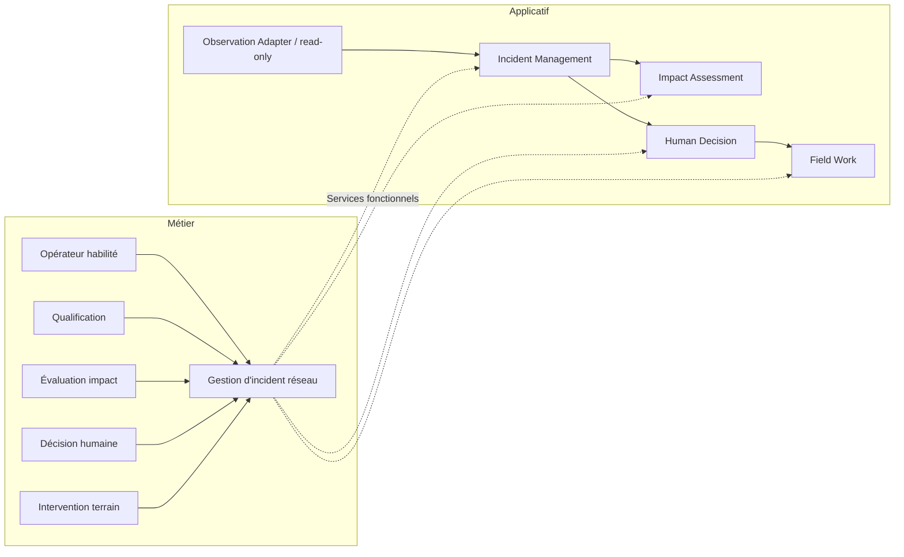

# ArchiMate 3.1 — vue métier/fonctionnelle (illustrative)

Le fichier [energy-grid-archimate.xml](energy-grid-archimate.xml) transporte un modèle de **21 éléments et 22 relations** via la convention ArchiMate Model Exchange File Format (namespace `http://www.opengroup.org/xsd/archimate/3.0/`).

Ce fichier ne contient **pas** de diagrammes natifs (view/diagram exchange). La vue lisible dans ce dossier est indépendante et ne prouve pas l'import dans Archi. Vérifier l'import dans un outil compatible ArchiMate et conserver journal/version de l'outil avant de fermer le gate E4 externe.

**Frontière OT / IT** : les observations sont intégrées via une façade en lecture seule ; la décision de conduite reste humaine et soumise aux systèmes OT autorisés. Cette vue ne décrit pas la topologie réelle d'Enedis.

Sources normatives pour vérification : [The Open Group Exchange Format](https://www.opengroup.org/open-group-archimate-model-exchange-file-format) ; [OMG BPMN 2.0.2](https://www.omg.org/spec/BPMN/2.0.2).
